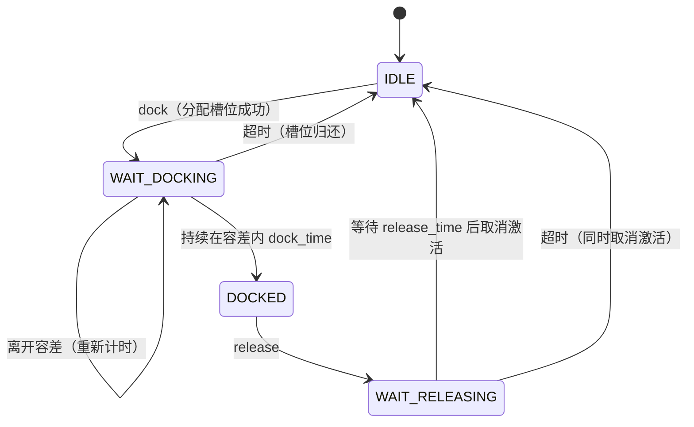

# mujoco_dock_sim_plugin

`mujoco_ros2_control` 插件：用一组 **weld 等式约束**模拟对接口的对接（dock）与释放（release）。

两个"对接口"用两个 MuJoCo **site** 表示；插件把 site 解析到其所属刚体上，把两个刚体焊住。对接是否成立由一个**目标相对位姿 + 容差 +（可选的）旋转对称性**决定。

- 服务：`~/dock`、`~/release`（阻塞式，返回最终结果）
- 动作：`~/dock`、`~/release`（带 feedback）

---

## 目录

- [1. 依赖与构建](#1-依赖与构建)
- [2. 核心概念](#2-核心概念)
- [3. site 帧约定](#3-site-帧约定)
- [4. 对接目标与对称性](#4-对接目标与对称性)
- [5. 状态机](#5-状态机)
- [6. 参数参考](#6-参数参考)
- [7. ROS 接口](#7-ros-接口)
- [8. 运行时行为与线程模型](#8-运行时行为与线程模型)
- [9. MJCF 侧要求](#9-mjcf-侧要求)
- [10. 场景示例](#10-场景示例)
- [11. 常见问题](#11-常见问题)

---

## 1. 依赖与构建

- 依赖 [mujoco_ros2_control](https://github.com/ros-controls/mujoco_ros2_control)、`mujoco_ros2_control_plugins`、`mujoco_vendor`
- 作为插件被 `mujoco_ros2_control` 节点加载：插件类通过 `pluginlib` 导出，插件配置写在传给节点的参数文件里
  （例如 `mujoco_ros2_control_plugins.yaml`，见[第 10 节](#10-场景示例)）

```bash
colcon build --symlink-install --packages-select mujoco_dock_sim_plugin
```

---

## 2. 核心概念

### weld 池（weld pool）

MuJoCo 的等式约束数量在**编译期固定**，插件无法在运行时新建约束，因此：

1. MJCF 预先声明若干 `weld` 约束；
2. 参数 `welds_pool` 列出其中属于本插件的那些 weld，每个 weld 就是池中的一个"槽位"：
   - 插件可以把槽位**重新指向**任意一对刚体，并改写其目标相对位姿，然后激活/取消；
   - 不在 `welds_pool` 里的 weld 插件完全不碰；
   - 若池中的 weld 在 MJCF 里**初始就是激活**的，说明该对接口初始就是"已对接"状态，
     插件会把它**采纳（adopt）**为一个 DOCKED 对，之后可正常 `release`。

请求一个池中暂时没有空闲槽位的对接会直接被拒绝（`state: "rejected"`），因此池大小 ≥ 场景中同时存在的最大对接数。
池中当前**已被激活**（即已对接）的槽位不会分配给新的对接请求。

### group（接口组）

`group` 用来区分"不同种类的对接口"：

- 一个 site 可以属于多个 group；
- 对接请求只会在**同时包含这两个 site** 的 group 中生效；
- 两个 site 属于多个 group 时，取名字排序（字母序）中**第一个**匹配的 group；
- 可选 `male_sites` / `female_sites` 做性别限制：组内同时给出两个列表时，只允许 male ↔ female 对接；
  只给其中一个列表是非法的（会报错）。

一个 group 用同一个 `dock_target`、容差和时间参数描述该种类接口的对接判据。

---

## 3. site 帧约定

插件本身不关心 site 帧的物理含义，但整个场景**最省事的写法**是让所有接口 site 统一按"连接器帧"定义：

| 轴 | 含义 |
|---|---|
| `+z` | 对接面**外法向**：背离自己所属的物体，指向配合件 |
| `+x` | 接口的**定位方向**（例如矩形凸台/插槽的 0.1 m 长边方向） |
| 原点 | **对接参考点**：插合时对方的 site 原点落在该点上 |

于是两个插合接口的 `z` 轴反平行；对 0.1 × 0.04 的矩形接口，`x` 轴也反平行（另一种插合相位是 `y` 反平行）。
这样全场景只有一个目标姿态，见下节。

> 其它约定也可以，只要把对应的目标位姿/对称性配置正确即可。

---

## 4. 对接目标与对称性

一个 group 用 `dock_target` 描述"什么算对准"：

```yaml
dock_target:
  position: [0.0, 0.0, 0.0]    # site2 原点在 site1 系下的目标位置
  quaternion: [0.0, 0.0, 1.0, 0.0]   # site2 在 site1 系下的目标姿态，(w, x, y, z)
  symmetry:
    mode: none                 # none | discrete | continuous
    axis: z                    # 对称轴（site1 系；默认 z = 插入轴）
    angles_deg: [0.0, 180.0]   # 仅 discrete 模式使用
```

判定与焊接规则：

1. 用**位置误差**（欧氏距离）和**姿态误差**（到"合法姿态集合"的最小夹角）与
   `position_tolerance` / `rotation_tolerance` 比较；
2. 合法姿态集合 = 目标姿态 × 对称自由度：

   | `mode` | 合法姿态集合 | 典型接口 |
   |---|---|---|
   | `none` | 只有 `quaternion` 本身 | 非对称 / 键槽、需要固定相位的矩形 |
   | `discrete` | `quaternion` 再绕 `axis` 转 `angles_deg` 中任一角度 | 矩形（0°/180°）、正方形（0°/90°/180°/270°） |
   | `continuous` | `quaternion` 再绕 `axis` 任意旋转 | 圆形对接口 |

3. 对接成功后，插件焊接的是**离当前实测位姿最近的合法姿态**（不是名义目标），
   因此对称接口不会被强行拧到某个相位，也不会在焊接瞬间产生跳变。

配合[第 3 节](#3-site-帧约定)的帧约定：

- 矩形接口（0.1 × 0.04）：`quaternion = [0, 0, 1, 0]`（绕 y 180°：z 反向、x 反向、y 同向）；
  要固定相位用 `mode: none`，允许两个相位用 `mode: discrete, angles_deg: [0, 180]`；
- 圆形接口：`quaternion` 取任意一个"z 反向"的姿态（如 `[0, 1, 0, 0]`），`mode: continuous, axis: z`。

> `quaternion` 的顺序是 **(w, x, y, z)**（与 MuJoCo 一致），注意和 ROS 消息里的 (x, y, z, w) 相反。

---

## 5. 状态机



- `dock` 到**已经对接**的 pair 会立即成功返回 `state: "already_docked"`；
- `release` 一个**未对接**的 pair 返回成功但 `state: "not_docked"`；
- MJCF 中初始激活的 weld 中的 pair，其相对位姿要在组容差内（否则不会被视为该组的合法对接）。

---

## 6. 参数参考

参数路径前缀为 `mujoco_plugins.<命名空间>.`，`<命名空间>` 即插件在节点下的子命名空间
（示例中为 `mujoco_dock_sim_plugin`，服务名也就成了 `/<命名空间>/dock`）。

| 参数 | 类型 | 默认 | 说明 |
|---|---|---|---|
| `welds_pool` | `string[]` | 空 | 本插件拥有的 weld 约束名（池槽位）。空 = 无法服务任何请求 |
| `groups.<name>.sites` | `string[]` | 空 | 该组的全部 site（必填） |
| `groups.<name>.male_sites` | `string[]` | 空 | 可选性别分组（与 `female_sites` 成对出现） |
| `groups.<name>.female_sites` | `string[]` | 空 | 可选性别分组 |
| `groups.<name>.position_tolerance` | `double` | `0.01` | 位置误差上限 [m] |
| `groups.<name>.rotation_tolerance` | `double` | `0.1` | 姿态误差上限 [rad] |
| `groups.<name>.dock_target.position` | `double[3]` | `[0,0,0]` | site2 原点在 site1 系下的目标位置 |
| `groups.<name>.dock_target.quaternion` | `double[4]` | `[1,0,0,0]` | 目标姿态 (w, x, y, z)，自动归一化 |
| `groups.<name>.dock_target.symmetry.mode` | `string` | `none` | `none` / `discrete` / `continuous` |
| `groups.<name>.dock_target.symmetry.axis` | `string` | `z` | `x` / `y` / `z`（site1 系） |
| `groups.<name>.dock_target.symmetry.angles_deg` | `double[]` | 空 | `discrete` 的相位（度）。为空时退化为 `none` 并告警 |
| `groups.<name>.dock_time` | `double` | `1.0` | 位姿需保持在容差内多久才算对接成功 [s] |
| `groups.<name>.release_time` | `double` | `0.0` | 释放耗时 [s] |

> 旧参数 `groups.<name>.dock_relpose`（`[pos(3), quat(wxyz)(4)]`）已被 `dock_target` 取代；
> 配置里若还存在该参数，插件会**报错并拒绝加载该组**，请迁移到
> `dock_target.position` + `dock_target.quaternion` + `dock_target.symmetry`。

插件启动时会为每个 group 打印一行摘要（site 数、目标位姿、对称性、容差、时间参数），便于核对配置。

---

## 7. ROS 接口

### 服务

| 服务 | 请求 | 响应 |
|---|---|---|
| `~/dock` | `site1`(string)、`site2`(string)、`group`(string，空=自动选组)、`timeout`(float，0=默认) | `success`、`message`、`state`、`relpose`(geometry_msgs/Pose，对接成功时的实测相对位姿) |
| `~/release` | `site1`、`site2`、`timeout` | `success`、`message`、`state` |

`state` 取值：

- dock：`docked` / `already_docked` / `rejected` / `timeout` / `cancelled`
- release：`released` / `not_docked` / `rejected` / `timeout` / `cancelled`

服务是**阻塞式**的：请求会一直等待到对接/释放完成或超时（默认超时 = `dock_time * 3 + 5` s，
`release_time * 3 + 5` s；`timeout` 给正值则用它）。

### 动作

| 动作 | Goal | Feedback | Result |
|---|---|---|---|
| `~/dock` | `site1`、`site2`、`group`、`timeout` | `state`(`waiting`/`within_tolerance`/`docked`)、`elapsed`、`position_error`、`rotation_error` | `success`、`message`、`relpose` |
| `~/release` | `site1`、`site2`、`timeout` | `state`(`waiting`/`releasing`/`released`)、`elapsed` | `success`、`message` |

动作的 goal 会立即被接受（拒绝只发生在 site 名不存在时），失败通过 result 的 `success=false` + `message` 返回。

### 命令行示例

```bash
# 把镜片从存储插口上松开
ros2 service call /mujoco_dock_sim_plugin/release mujoco_dock_sim_plugin/srv/Release \
  "{site1: 'len_ring_1_S0', site2: 'len_dock_1_site', timeout: 15.0}"

# 对准后对接（group 留空 -> 自动选组）
ros2 service call /mujoco_dock_sim_plugin/dock mujoco_dock_sim_plugin/srv/Dock \
  "{site1: 'len_ring_1_S0', site2: 'len_center_S3', group: '', timeout: 20.0}"
```

---

## 8. 运行时行为与线程模型

- ROS 回调（服务/动作）运行在 executor 线程上，**只把任务塞进队列**；
- `update()` 运行在 ros2_control 的控制线程，接收一份 `mjData` 快照，推进状态机、
  判定容差、产生"待施加的 weld 变更"；
- `pre_step()` 运行在**物理线程**、`mj_step()` 之前一步，真正改写 `mjModel`（weld 的刚体与目标位姿）
  和 `mjData::eq_active`。

之所以把激活动作放在 `pre_step()`：`update()` 拿到的是快照，对 `eq_active` 的修改会被丢弃
（只有 `ctrl` / `qfrc_applied` 会回写），而 `pre_step()` 的修改一定能被下一次物理步看到。

`on_reset()` 会清空所有内部状态（`eq_active` 会被 MJCF 默认值覆盖），之后需要重新发起对接。

---

## 9. MJCF 侧要求

1. 池中的 weld 必须在 MJCF 里**预先声明**（数量编译期固定）；类型必须是 `weld`，否则加载时跳过并告警；
2. MuJoCo 只在 **body weld** 上支持非单位 `relpose`（`site1`/`site2` 形式的 weld 会强制让两个 site 帧重合），
   因此池中的 weld 建议一律写成 body weld —— 插件会在对接时把它们重新指向正确的刚体并写入
   `relpose = S1 ∘ T_site ∘ inv(S2)`（`S1`/`S2` 为 site 在各自刚体中的位姿，`T_site` 为 site 语义下的目标相对位姿）；
3. 想让某些接口**初始就是已对接**状态：把对应 weld 在 MJCF 里写成 `active="true"`，
   并保证它的 `relpose` 与当时的实际相对位姿一致（插件不会去校正初始激活 weld 的目标位姿）；
4. site 名要与配置里的名字完全一致；所属刚体必须是刚体（body），插件用 `site_bodyid` 解析。

---

## 10. 场景示例

`space_sim_mujoco_description/config/mujoco_ros2_control_plugins.yaml` 的完整用法：

```yaml
/**:
  ros__parameters:
    mujoco_plugins:
      mujoco_dock_sim_plugin:
        type: "mujoco_dock_sim_plugin/DockSimPlugin"
        welds_pool:                      # 14 个池槽位（MJCF 里预先声明）
          - "dock_weld_1"                # 6 个镜片 <-> 卫星底部插口（MJCF 中 active=true）
          # ...
          - "center_weld_6"              # 6 个镜片 <-> 中心镜片（inactive）
          - "tcp_weld_A"                 # 2 个机械臂末端（inactive）
          - "tcp_weld_B"
        groups:
          # 存储 / 穹顶装配：固定相位（y 同向、x 反向）
          default:
            sites: ["len_ring_1_S0", ..., "len_center_S5", "len_dock_1_site", ...]
            position_tolerance: 0.01
            rotation_tolerance: 0.15
            dock_target:
              position: [0.0, 0.0, 0.0]
              quaternion: [0.0, 0.0, 1.0, 0.0]   # 绕 y 180°
              symmetry: {mode: none, axis: z}
            dock_time: 0.5
            release_time: 0.2
          # 机械臂磁吸抓取：矩形面两个相位都允许
          grasp:
            sites: ["len_ring_1_S0", ..., "arm_A__tcp_site", "arm_B__tcp_site"]
            position_tolerance: 0.01
            rotation_tolerance: 0.15
            dock_target:
              position: [0.0, 0.0, 0.0]
              quaternion: [0.0, 0.0, 1.0, 0.0]
              symmetry:
                mode: discrete
                axis: z
                angles_deg: [0.0, 180.0]
            dock_time: 0.5
            release_time: 0.2
```

该场景的 site 帧由 `tmp/gen_space_sim_config.py` 生成，规则即[第 3 节](#3-site-帧约定)
（z = 对接面外法向、x = 0.1 m 长边、原点 = 对接参考点），
并且脚本会求解每个 site 的 180° 翻转位，使所有既定对接对都精确等于 `(0, 0, 1, 0)`
（`tmp/check_mjcf.py` 可复核）。

---

## 11. 常见问题

| 现象 | 原因 / 处理 |
|---|---|
| 启动时告警 `No 'welds_pool' configured` | 没配 `welds_pool`，插件没有任何槽位可用，所有 dock 请求都会被拒 |
| `dock` 返回 `rejected: No free slot in the weld pool` | 池中空闲槽位耗尽（同时对接数超过池大小），或剩余槽位当前是激活状态 |
| `dock` 一直超时 | 相对位姿没进入容差：检查目标位姿/对称性/site 帧约定，或把 `position_tolerance` / `rotation_tolerance` 放宽；注意 `discrete` 只接受列出的相位 |
| 启动即报错 `'dock_relpose' is no longer supported` | 旧配置未迁移，改用 `dock_target.*` |
| 启动即报错 `dock_target.position must have exactly 3 values` | 参数长度写错（`quaternion` 必须 4 个，`position` 必须 3 个） |
| `discrete` 但只有名义姿态有效 | `angles_deg` 为空（插件会告警并退化为 `none`） |
| 焊接后位姿与名义目标不同 | 正常：对称接口焊到"最近的合法姿态"，不是名义姿态 |
| 某个接口 release 后仍被约束住 | 该 pair 未被插件跟踪、且其 weld 初始就是 `active=true`：直接 `release` 会用池中对应槽位强制取消激活；也可先检查 `welds_pool` 是否包含该 weld |
| 对接成功瞬间物体跳一下 | 实测位姿与焊接目标之间的差值（≤ 容差），可用更小的 `rotation_tolerance` / `position_tolerance` 或 `dock_time` 收敛后再对接 |
